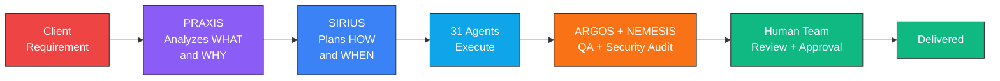
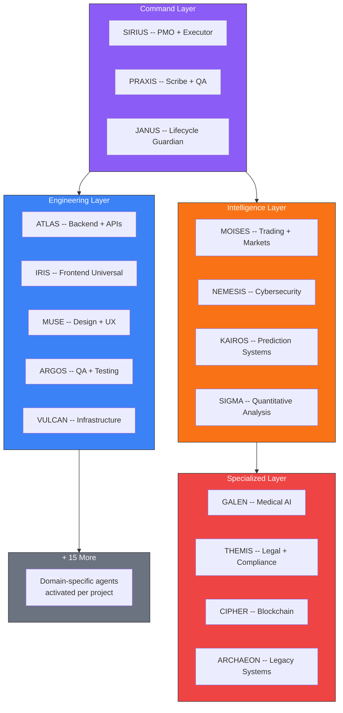

# SOUL CORE

### The AI-Native Development Ecosystem

*A hybrid team of engineers + 31 specialized AI agents*
*that think, remember, and collaborate as a single engineering organism.*

*What takes traditional teams months, we ship in days.*

[Explore Repos](https://github.com/soulcore-dev?tab=repositories) | [Hire Us](#work-with-us) | [Our Stack](#technology-stack)

---

## How It Works

Every project flows through a battle-tested pipeline where humans direct, AI agents execute, and humans approve:

> Every line of code is reviewed by humans. Every decision is audited. AI accelerates -- humans approve.

## The Team

We are a hybrid team: human engineers who direct, review, and make final decisions, plus 31 AI agents that execute with domain expertise and persistent memory.

### Human Team

<table>
<tr>
<td align="center" width="16%">
<strong>R. Paul</strong> 
Founder / Director 
Mechatronics Eng. 
7+ years
</td>
<td align="center" width="16%">
<strong>R. Santos</strong> 
Lead Developer 
Full-Stack + Trading 
Infrastructure
</td>
<td align="center" width="16%">
<strong>M. Diaz</strong> 
Business Director 
Corporate Relations 
Enterprise Clients
</td>
<td align="center" width="16%">
<strong>G. Vidal</strong> 
Sales Lead 
Client Acquisition 
Partnerships
</td>
<td align="center" width="16%">
<strong>A. Martinez</strong> 
Digital Marketing 
Client Activation 
Content Strategy
</td>
<td align="center" width="16%">
<strong>L. Reyes</strong> 
Digital Marketing 
Brand + Outreach 
Social Media
</td>
</tr>
</table>

### AI Agent Layer (31 Specialized Agents)

Every agent has:
- **Persistent memory** -- remembers past sessions and decisions
- **Domain expertise** -- specialized knowledge, not generic AI
- **Learning capability** -- improves with every interaction (Hebbian/STDP)
- **MCP integration** -- uses tools, APIs, and services autonomously

## What We Ship

<table>
<tr>
<td width="50%">

### Cybersecurity

Real penetration testing. Real findings. Real remediation.

| Metric | Value |
|--------|-------|
| Findings (single audit) | **44** |
| Highest CVSS discovered | **9.1** |
| Solidity exploit templates | **49** |
| Audit score improvement | **5.5 to 8.5** |

**Repos:** [gRPC Audit](https://github.com/soulcore-dev/grpc-security-audit-evolution) - [Auth Bypass](https://github.com/soulcore-dev/nextjs-auth-bypass-case-study) - [Solidity Exploits](https://github.com/soulcore-dev/solidity-exploit-templates)

</td>
<td width="50%">

### Trading Systems

Professional MT5 frameworks. Prop firm ready. Battle-tested.

| Metric | Value |
|--------|-------|
| Framework lines | **14,000+** |
| Files | **190+** |
| Supported firms | FTMO, The5ers, APEX |
| Verified profit | **49% in 8 months** |

**Repos:** [MT5 Infrastructure](https://github.com/soulcore-dev/MT5-Trading-Infrastructure) - [Risk Manager](https://github.com/soulcore-dev/MOISES_RISK_MANAGER_LIB)

</td>
</tr>
<tr>
<td width="50%">

### Full-Stack Platforms

Multi-tenant SaaS, cloud accounting, booking systems.
From architecture to production in days.

| Metric | Value |
|--------|-------|
| Lines (single project) | **94,000+** |
| Tasks completed | **32/32** |
| AI features built | Text, Image, Styling, Assistant |
| Stack | Next.js + FastAPI + Supabase |

**Repos:** [Kofacture](https://github.com/soulcore-dev/kofacture) - [PolyStore](https://github.com/soulcore-dev/PolyStore-Showcase)

</td>
<td width="50%">

### AI / Computer Vision

Precision agriculture, multi-agent consensus,
swarm intelligence prediction engines.

| Metric | Value |
|--------|-------|
| AI agents in ecosystem | **31** |
| MCP servers | **12** |
| Cognitive engine | Custom built (Go) |
| Development speed | **90x vs traditional** |

**Repos:** [FarmVision](https://github.com/soulcore-dev/FARMVISION_SHOWCASE) - [Web Platform](https://github.com/soulcore-dev/SOULCORE_WEB_SHOWCASE)

</td>
</tr>
</table>

## Technology Stack

```mermaid
graph LR
    subgraph L["Languages"]
        direction TB
        GO["Go"]
        PY["Python"]
        TS["TypeScript"]
        MQL["MQL5"]
        SOL["Solidity"]
    end

    subgraph F["Frameworks"]
        direction TB
        NX["Next.js 14"]
        FA["FastAPI"]
        FL["Flask"]
        VU["Vue.js"]
    end

    subgraph I["Infrastructure"]
        direction TB
        DK["Docker"]
        SB["Supabase"]
        PG["PostgreSQL"]
        VC["Vercel"]
    end

    subgraph A["AI Layer"]
        direction TB
        MCP["12 MCP Servers"]
        NC["Neuron-Core Engine"]
        LLM["Multi-LLM Support"]
        SW["Swarm Intelligence"]
    end

    L --> F --> I --> A

    style L fill:#1e293b,stroke:#8b5cf6,color:#fff
    style F fill:#1e293b,stroke:#3b82f6,color:#fff
    style I fill:#1e293b,stroke:#10b981,color:#fff
    style A fill:#1e293b,stroke:#f97316,color:#fff
```

## MCP Servers -- Coming Soon

Open source tools for the AI agent ecosystem:

| Server | Description | Status |
|--------|-------------|--------|
| **Voice MCP** | Talk to your AI instead of typing | Ready |
| **Cognitive Engine** | Persistent memory with Hebbian learning | Ready |
| **Trading MCP** | Full Binance integration for AI agents | In Development |
| **Decision Framework** | Flow-based decision analysis | Ready |

## Open Source Philosophy

> **What you see here is the visible half.**
> **The orchestration layer that coordinates 31 agents? That stays private.**

We publish tools that solve real problems. We keep our competitive advantage internal.
You get powerful, free tools. We get to keep building the future.

---

## Work With Us

We take on projects where speed and quality matter more than team size.

| Service | What You Get |
|---------|-------------|
| **Cybersecurity** | Pentesting, audits, vulnerability research, remediation |
| **Trading Systems** | MT5/MQL5, algorithmic trading, risk management, prop firm tools |
| **Full-Stack SaaS** | Multi-tenant platforms, AI integration, cloud deployment |
| **AI Integration** | Custom MCP servers, multi-agent systems, computer vision |

**Minimum engagement:** $50/hr | **Typical project:** 1-4 weeks | **Speed:** 90x

[Open an issue](https://github.com/soulcore-dev/soulcore-dev/issues) | contact@soulcore.dev

---

**SOUL CORE** -- *A hybrid team of humans and AI, working as one.*

Dominican Republic | Remote Worldwide | Since 2019

