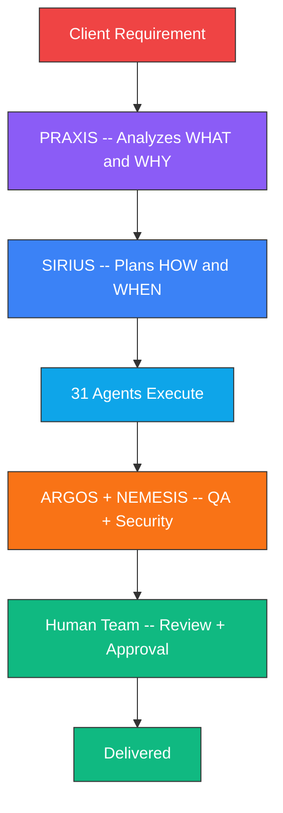
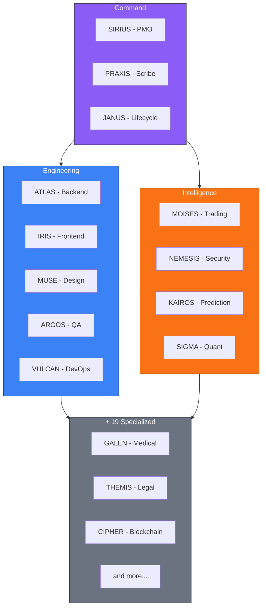
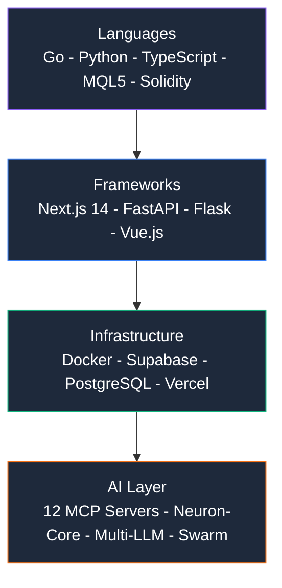

# SOUL CORE

### The AI-Native Development Ecosystem

*A hybrid team of engineers + 31 specialized AI agents*
*that think, remember, and collaborate as one.*

[Repos](https://github.com/soulcore-dev?tab=repositories) | [Hire Us](#work-with-us) | [Stack](#technology-stack)

---

## How It Works

> Every line of code is reviewed by humans. AI accelerates -- humans approve.

## The Team

**Human engineers** who direct, review, and make final decisions + **31 AI agents** with persistent memory and domain expertise.

<table>
<tr>
<td align="center" width="16%"><strong>R. Paul</strong> Founder</td>
<td align="center" width="16%"><strong>R. Santos</strong> Lead Dev</td>
<td align="center" width="16%"><strong>M. Diaz</strong> Business</td>
<td align="center" width="16%"><strong>G. Vidal</strong> Sales</td>
<td align="center" width="16%"><strong>A. Martinez</strong> Marketing</td>
<td align="center" width="16%"><strong>L. Reyes</strong> Marketing</td>
</tr>
</table>

## AI Agent Architecture

## What We Ship

| Area | Highlights | Repos |
|------|-----------|-------|
| **Cybersecurity** | 44 findings in 1 audit, CVSS 9.1, 49 exploit templates | [gRPC Audit](https://github.com/soulcore-dev/grpc-security-audit-evolution) - [Auth Bypass](https://github.com/soulcore-dev/nextjs-auth-bypass-case-study) - [Exploits](https://github.com/soulcore-dev/solidity-exploit-templates) |
| **Trading** | 14K+ lines MQL5, 190 files, FTMO/The5ers/APEX | [MT5 Infra](https://github.com/soulcore-dev/MT5-Trading-Infrastructure) - [Risk Mgr](https://github.com/soulcore-dev/MOISES_RISK_MANAGER_LIB) |
| **Full-Stack** | 94K lines, 32/32 tasks, AI features, multi-tenant | [Kofacture](https://github.com/soulcore-dev/kofacture) - [PolyStore](https://github.com/soulcore-dev/PolyStore-Showcase) |
| **AI / CV** | 31 agents, 12 MCPs, computer vision, swarm prediction | [FarmVision](https://github.com/soulcore-dev/FARMVISION_SHOWCASE) - [Platform](https://github.com/soulcore-dev/SOULCORE_WEB_SHOWCASE) |

## Technology Stack

## Open Source MCP Servers -- Coming Soon

| Server | Description | Status |
|--------|-------------|--------|
| **Voice MCP** | Talk to your AI instead of typing | Ready |
| **Cognitive Engine** | Persistent memory with Hebbian learning | Ready |
| **Trading MCP** | Full Binance integration | In Dev |
| **Decision Framework** | Flow-based analysis (VMOF) | Ready |

---

## Work With Us

| Service | What You Get |
|---------|-------------|
| **Cybersecurity** | Pentesting, audits, vulnerability research |
| **Trading Systems** | MT5/MQL5, algo trading, prop firm tools |
| **Full-Stack SaaS** | Multi-tenant, AI integration, cloud deploy |
| **AI Integration** | MCP servers, multi-agent, computer vision |

**Rate:** $50/hr+ | **Speed:** 90x | **Remote worldwide**

[Open an issue](https://github.com/soulcore-dev/soulcore-dev/issues) | contact@soulcore.dev

**SOUL CORE** -- *Humans and AI, working as one.*

Dominican Republic | Since 2019

