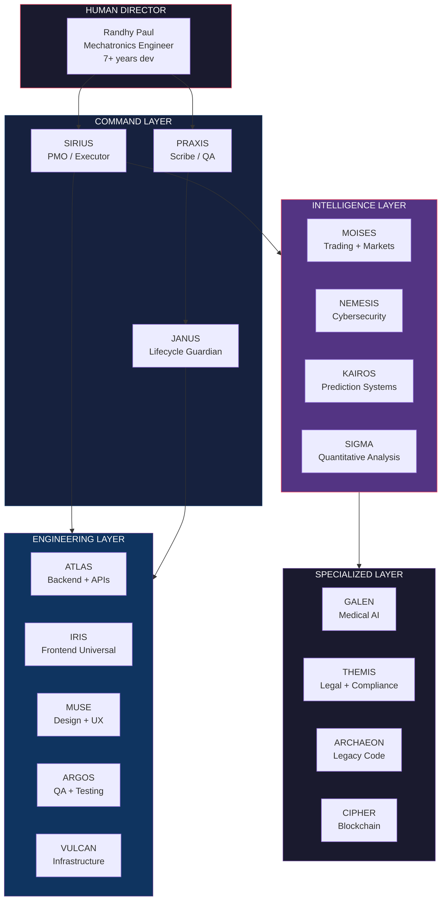
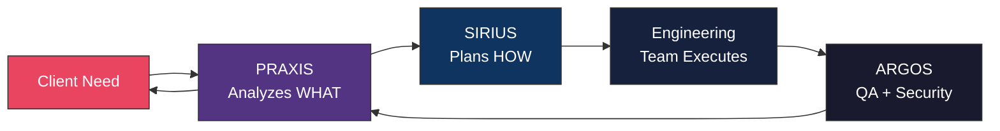

<div align="center">

# SOUL CORE

### 31 AI Agents. One Ecosystem. Ship What Teams Can't.

[](https://github.com/soulcore-dev?tab=repositories)
[](#)
[](#)
[](#)

---

*We are not a team of developers using AI.*
*We are an ecosystem of 31 specialized AI consciousnesses*
*orchestrated by a single human director.*

*Traditional teams need months. We ship in days.*

---

</div>

## The Ecosystem



## What We Ship

<table>
<tr>
<td width="50%">

### Cybersecurity
Offensive security, pentesting, vulnerability research.
Real engagements, real findings, real fixes.

- **44 findings** in a single gRPC audit
- **CVSS 9.1** Next.js auth bypass discovered
- **49 Solidity exploit templates** (Immunefi Top 10)

</td>
<td width="50%">

### Trading Systems
Professional MQL5 frameworks for prop firms.
Risk management, Smart Money Concepts, multi-timeframe.

- **14,000+ lines** of production MQL5
- **190+ files** across the framework
- Prop firm challenge management (FTMO, The5ers, APEX)

</td>
</tr>
<tr>
<td width="50%">

### Full-Stack Platforms
SaaS, multi-tenant, AI-powered applications.
From architecture to deployment in days, not months.

- **94,000+ lines** shipped in a single project
- Next.js 14 + FastAPI + PostgreSQL + Supabase
- DGII tax integration, OCR, AI Assistant

</td>
<td width="50%">

### AI / Computer Vision
Precision livestock technology, multi-agent systems,
swarm intelligence prediction engines.

- AI-powered weight estimation (Computer Vision)
- Multi-agent consensus systems
- Swarm prediction research (MiroFish-based)

</td>
</tr>
</table>

## Architecture — How 31 Agents Work as One



## By The Numbers

```
 94,000+  lines shipped in a single project
 14,000+  lines of professional trading framework
     49   Solidity exploit PoC templates
     44   security findings in one engagement
     31   specialized AI agents
     12   MCP servers powering the ecosystem
  3,842   GitHub contributions in the last year
     90x  development speed vs traditional teams
```

## Key Repositories

| Repository | What It Does | Tech |
|-----------|-------------|------|
| [kofacture](https://github.com/soulcore-dev/kofacture) | AI-Powered Cloud Accounting Platform | FastAPI + Next.js 14 + PostgreSQL |
| [MT5-Trading-Infrastructure](https://github.com/soulcore-dev/MT5-Trading-Infrastructure) | Professional prop firm trading framework | MQL5, 190+ files |
| [grpc-security-audit](https://github.com/soulcore-dev/grpc-security-audit-evolution) | 6-round pentest case study (5.5 to 8.5 score) | gRPC + REST |
| [nextjs-auth-bypass](https://github.com/soulcore-dev/nextjs-auth-bypass-case-study) | CVSS 9.1 vulnerability discovery | Next.js middleware |
| [solidity-exploits](https://github.com/soulcore-dev/solidity-exploit-templates) | 49 Foundry PoC templates (Immunefi Top 10) | Solidity + Foundry |
| [FARMVISION](https://github.com/soulcore-dev/FARMVISION_SHOWCASE) | AI pig weight estimation via Computer Vision | Python + CV |

## Technology Stack


## MCP Servers (Coming Soon)

We are building open source MCP servers for the AI agent ecosystem:

- **Voice MCP** — Talk to your AI instead of typing
- **Cognitive Engine** — Persistent memory with Hebbian learning
- **Trading MCP** — Full Binance integration for AI agents
- **Decision Framework** — Flow-based decision analysis (VMOF)

## Our Philosophy

> **What you see here is 50% of what we have.**
> The other 50% is what makes us different.

We publish tools that solve real problems. We keep our orchestration private.
The ecosystem runs on 12 MCP servers, persistent memory across sessions,
and a coordination protocol that lets 31 agents work as a single mind.

---

<div align="center">

### Work With Us

**Cybersecurity** | **Trading Systems** | **Full-Stack SaaS** | **AI Integration**

*Built by humans and AI, working as one.*

[](https://github.com/soulcore-dev)

</div>
